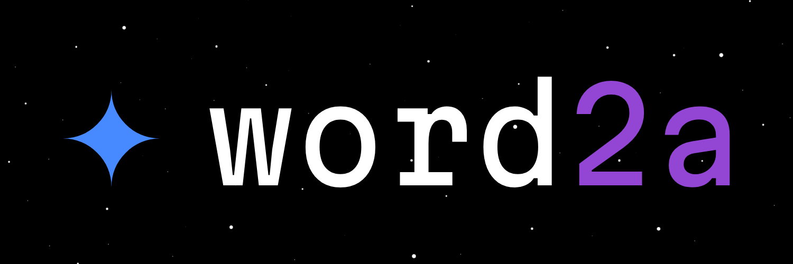

A simple terminal **word game** built with RataTUI, based on a .txt dictionary file, basically an unofficial, rust-based, wordle TUI. You have six tries to guess a five-letter word random picked from the dictionary. Colors show which letters are correct or appear in another position.

Run with `cargo run --release`. Press `Enter` to submit, `Backspace` to delete, and `Esc` to quit.

You can install it from the AUR:
```
yay -S word2a
```


License: [GNU GPL 3.0](LICENSE).
